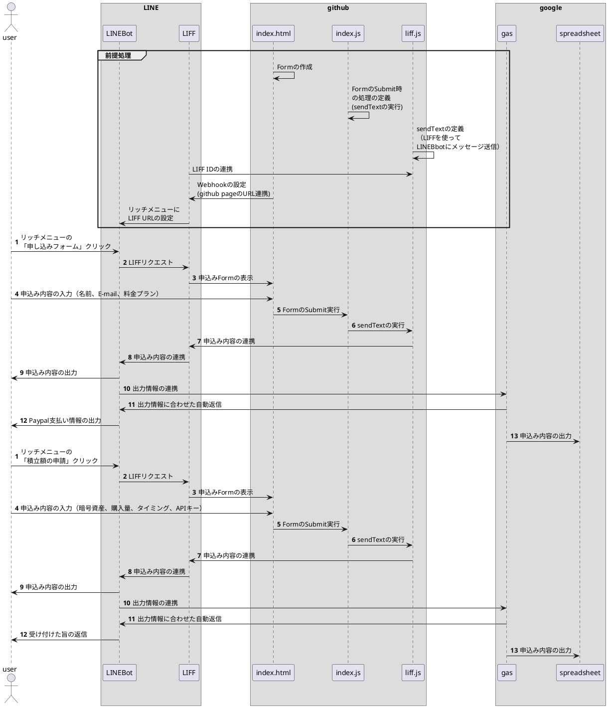

# LINEBot概要

## シーケンス図

```plantuml
@startuml
actor user
box LINE
participant LINEBot as line
participant LIFF 
end box
box github
participant index.html 
participant index.js 
participant liff.js  
end box
box google
participant gas
participant spreadsheet as sheet
end box

group 前提処理
index.html -> index.html : Formの作成
index.js -> index.js : FormのSubmit時\nの処理の定義\n(sendTextの実行)
liff.js -> liff.js : sendTextの定義\n（LIFFを使って\nLINEBbotにメッセージ送信）
LIFF -> liff.js : LIFF IDの連携
index.html -> LIFF : Webhookの設定\n(github pageのURL連携)
LIFF -> line : リッチメニューに\nLIFF URLの設定
end
autonumber
user -> line : リッチメニューの\n「申し込みフォーム」クリック
line -> LIFF : LIFFリクエスト
LIFF -> index.html :申込みFormの表示
user -> index.html : 申込み内容の入力（名前、E-mail、料金プラン）
index.html -> index.js : FormのSubmit実行
index.js -> liff.js : sendTextの実行
liff.js -> LIFF : 申込み内容の連携
LIFF -> line : 申込み内容の連携
line -> user : 申込み内容の出力
line -> gas : 出力情報の連携
gas -> line : 出力情報に合わせた自動返信
line -> user : Paypal支払い情報の出力
gas -> sheet : 申込み内容の出力

autonumber
user -> line : リッチメニューの\n「積立額の申請」クリック
line -> LIFF : LIFFリクエスト
LIFF -> index.html :申込みFormの表示
user -> index.html : 申込み内容の入力（暗号資産、購入量、タイミング、APIキー）
index.html -> index.js : FormのSubmit実行
index.js -> liff.js : sendTextの実行
liff.js -> LIFF : 申込み内容の連携
LIFF -> line : 申込み内容の連携
line -> user : 申込み内容の出力
line -> gas : 出力情報の連携
gas -> line : 出力情報に合わせた自動返信
line -> user : 受け付けた旨の返信
gas -> sheet : 申込み内容の出力

@enduml
```

## リッチメニュー項目
1. システム概要
2. 申し込みフォーム
3. APIキーの取得方法
4. 積立額の申請
5. お問い合わせフォーム
   1. 料金変更
   2. 退会
   3. その他お問い合わせ

<!-- - `index.html` `index.js` `liff.js`の関係がいまいちよくわからない  -->
